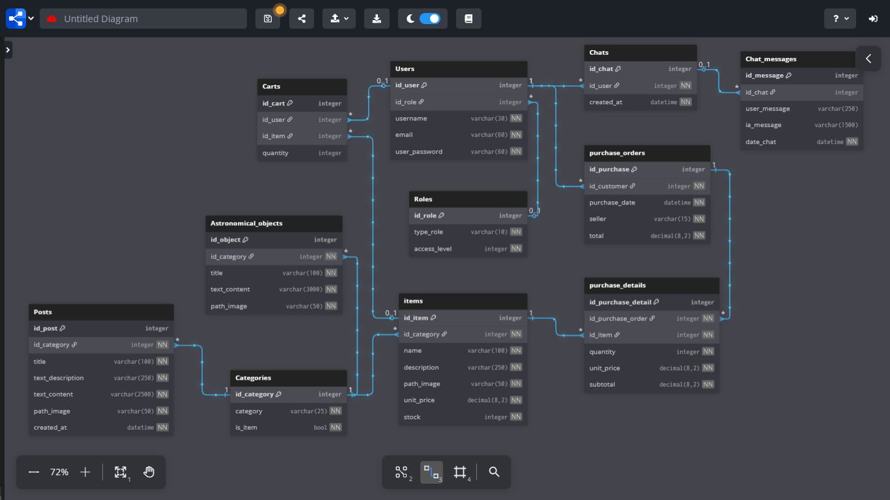

# Space hub - Aplicación Web
Space Hub es una plataforma diseñada para explorar el espacio exterior de forma accesible y educativa para todo el público. Permite aprender sobre planetas, estrellas, galaxias y otros objetos astronómicos de manera sencilla y visual.
Incluye una sección de noticias astronómicas donde se publican los eventos más recientes e impactantes del universo, con notificaciones en tiempo real cada vez que se crea una nueva publicación.
Además, cuenta con una tienda espacial donde puedes adquirir recuerdos únicos y apoyar el desarrollo de la plataforma.

## Tabla de contenido
1. [Características](#características)
3. [BackEnd](#backend)
4. [Base de datos](#base-de-datos)
5. [Documentacion](#documentacion)
6. [Pruebas unitarias](#pruebas-unitarias)
7. [Monitoreo de rutas](#monitoreo-de-rutas)
8. [FrontEnd](#frontend)
9. [Visuales del sistema](#visuales-del-sistema)
10. [Inicio](#inicio)
## Características
- Gestión de usuarios implementación de tokens de y autenticación mediante cookies
<!-- - Implementación de variables de entorno para el acceso a diferentes servicios y otros usos específicos -->
- Implementación de APIs de terceros para incorporar servicios como pasarela de pagos
- Optimización de APIs mediante la implementacion de cache, optimizacion de las consultas mediante indices, y la limitacion del numero de peticiones
- Chat bot con modelo de inteligencia artificial de Gemini para acompañar el aprendizaje
## BackEnd
- Tecnologías utilizadas: C# .NET Core ASP.NET dotnet 
```
App/
│
├── Controllers/   # Procesan las peticiones y contienen la lógica de las respuestas
├── Data/          # Configuración del constructor de AppDbContext y definición de entidades
├── DTOs/          # Clases que representan modelos de datos utilizados en transacciones
├── Hubs           # Conexión para notificación en tiempo real
├── Logs/          # Configuración de logs y monitoreo de la aplicación
├── Models/        # Clases que representan las entidades de la base de datos
├── Properties     # Archivo launch json
├── Repository/    # Clases que interactúan con la base de datos mediante Entity Framework
├── Views/         # Archivos de vistas
├── wwwroot/       # Archivos estaticos
└── Program.cs     # Punto de entrada de la aplicación (configuración del servidor)
```
## Base de datos
La percistencia de informacion se realiza a traves de una base de datos relacional, la misma esta diseñada y graficada con la herramienta [dbdiagram.io](https://dbdiagram.io/), el BackEnd utiliza Entity Framework para la interacción con la base de datos, a través de un ORM
- Diagrama de Base de datos creado con dbdiagram.io


- Base de datos relacional
- Modelos y consultas utilizando un ORM de Entity Framework, implementa paginación y DTOs para optimizar las consultas y no exponer las entidades
- Gestor de base de datos: SQL Server
## Documentacion
- Documentación de APIs: la documentación de los endpoint y APIs esta creada con Swagger Open.io
- Enlace: documentación disponible en [docs](/swagger)
## Pruebas unitarias
- Librerias: las pruebas unitarias estan creadas con la libreria de Xunit y Mock
```
Tests/
│
├── PostControllerTests.cs   # test del controlador que de procesa los posts
```
- Iniciar test: con el siguiente comando ejecuta las pruebas unitarias
```bash
dotnet test
```
## Monitoreo de la aplicación
- Monitoreo: se realiza mediante un middleware y la implementacion de la clase que contiene la lógica para crear logs personalizados
## FrontEnd
- Tecnologías utilizadas: Razor Pages CSS3 JavaScript
```
App/
|── Views/
|   └── views/ # archivos de vistas Razor Pages
|── wwwroot/
|   ├── css/     # archivos de estilos
|   ├── images/  # Carpetas de imagenes para recursos graficos
|   └── js/      # archivos javascripts
```

## Visuales del sistema
### Panel principal


### Objetos astronómicos


### Noticias espaciales


### Tienda espacial


### Chat bot con IA generativa de texto


## Inicio
- Inicio de la aplicación: una vez clonado el repositorio se debe escribir el siguiente comando en la terminal
```bash
dotnet run
```
